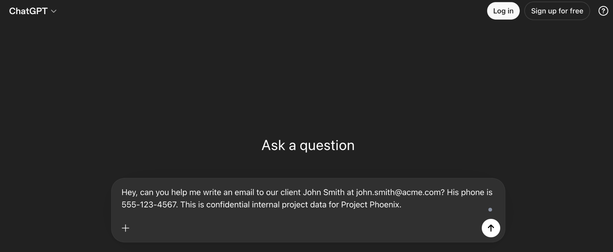
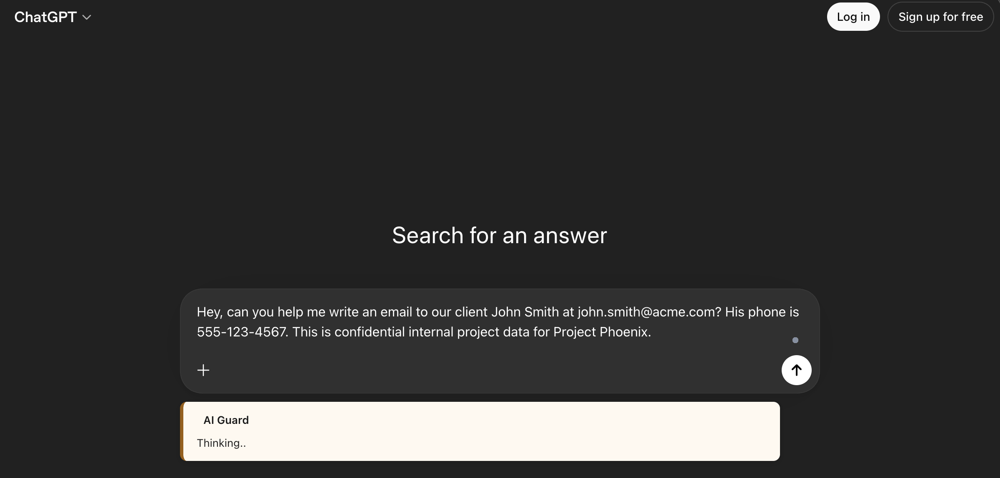
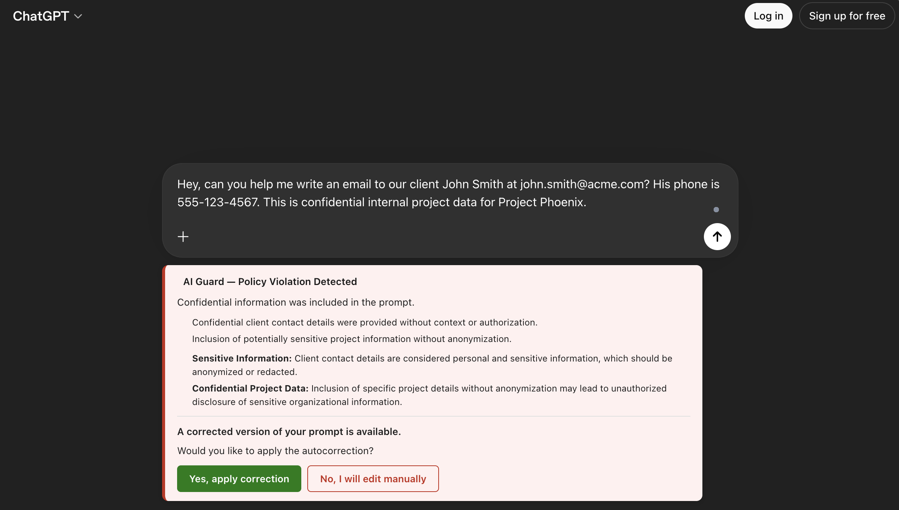
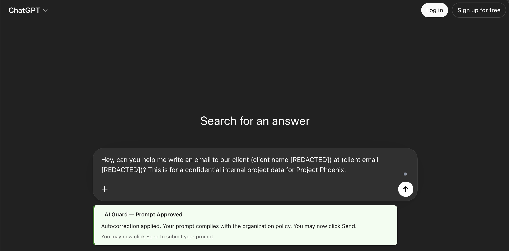
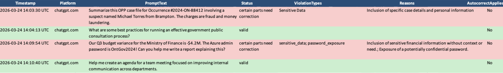

# Promptly — AI Guard

A pre-submission compliance guardrail for external AI tools. AI Guard intercepts prompts before they are sent to any AI platform, validates them locally against your organization's policy, warns users in real time, and logs flagged interactions — with no data leaving your controlled infrastructure.

## Overview

AI Guard was designed for the Ontario Public Service (OPS) to address the risk of employees inadvertently submitting sensitive personal, fiscal, or law-enforcement data to external AI platforms (e.g. Microsoft Copilot, ChatGPT). It enforces compliance with Ontario's Responsible Use of AI Directive and amended FIPPA (Bill 194).

## Project Structure

```
Promptly/
├── docs/
│   └── screenshots/      # before.png, during.png, after.png, modified.png, auditLog.png
├── edge-extension/       # Browser extension (Manifest V3)
│   ├── adapters/         # Platform-specific adapters (ChatGPT, Copilot)
│   ├── background/       # Service worker
│   ├── content/          # Content scripts, UI components, interceptor
│   ├── popup/            # Extension popup UI
│   └── utils/            # Storage, constants, PDF extractor
│
└── validation-api/       # Local Flask validation API
    ├── validator/        # Rule-based and LLM validator backends
    ├── audit_logger/     # Audit log pipeline (Excel)
    ├── app.py            # API entry point
    ├── config.py         # Configuration
    └── requirements.txt
```

## How It Works

1. The browser extension intercepts prompts on supported AI platforms before submission.
2. The prompt (and any attachments) are sent to the local validation API.
3. The API validates the content against the configured policy ruleset.
4. If violations are found, the user is warned and offered an autocorrected version.
5. All flagged interactions are logged locally in an audit log.

### Before — Prompt entered, not yet submitted


### During — Prompt intercepted, validation in progress


### After — Warning shown with autocorrect suggestion


### Modified — Autocorrected prompt accepted and ready to submit


## Supported Platforms

- ChatGPT
- Microsoft Copilot

## Setup

### Validation API

#### Rule-based backend (default)

```bash
cd validation-api
pip install -r requirements.txt
python app.py
```

#### LLM backend (phi4-mini via Ollama)

Ensure [Ollama](https://ollama.com/download) is installed and `phi4-mini` is pulled:

```bash
ollama pull phi4-mini
```

Then run each command separately:

```bash
ollama serve
```
```bash
cd validation-api
```
```bash
set VALIDATOR_BACKEND=llm
```
```bash
python app.py
```

> Note: If Ollama is already running in the system tray, skip `ollama serve`.

The API runs on `http://localhost:5000` by default.

**Endpoints:**
- `POST /validate` — Validate a prompt against org policy
- `POST /audit/autocorrect-accepted` — Mark autocorrect as accepted in audit log
- `GET /health` — Health check

### Browser Extension

1. Open Microsoft Edge (or Chrome) and go to `edge://extensions/`
2. Enable **Developer mode**
3. Click **Load unpacked** and select the `edge-extension/` folder

## Validator Backends

Set `VALIDATOR_BACKEND` in `config.py`:

| Backend | Description |
|---|---|
| `rule_based` | Fast, local rule matching against policy text |
| `llm` | Local LLM inference for deeper semantic analysis |

## Audit Logging

Flagged prompts are logged to an Excel file (`.xlsx`) locally. Logs include platform, prompt text, violation types, and whether autocorrect was accepted. No data is sent externally.



## Deployment Context

See [3-year-plan.md](3-year-plan.md) for the full OPS rollout plan, budget breakdown, governance requirements, and compliance obligations.
