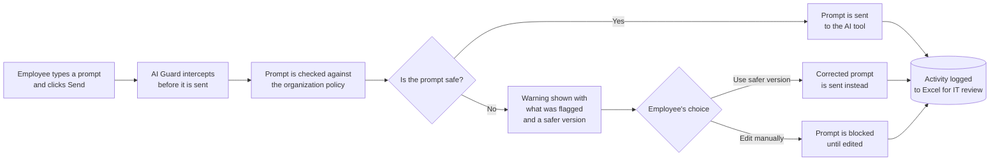

```mermaid
flowchart LR
    A[Employee types a prompt\nand clicks Send] --> B[AI Guard intercepts\nbefore it is sent]
    B --> C[Prompt is checked against\nthe organization policy]
    C --> D{Is the prompt safe?}

    D -- Yes --> E[Prompt is sent\nto the AI tool]
    D -- No --> F[Warning shown with\nwhat was flagged\nand a safer version]

    F --> G{Employee's choice}
    G -- Use safer version --> H[Corrected prompt\nis sent instead]
    G -- Edit manually --> I[Prompt is blocked\nuntil edited]

    E --> J[(Activity logged\nto Excel for IT review)]
    H --> J
    I --> J
```
